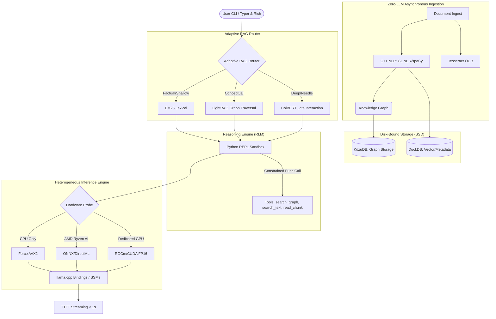

# CLIRAG: CLI Retrieval-Augmented Generation

  

**CLIRAG** is a disruptive, 100% offline, hardware-agnostic Edge AI analysis engine built for the **AMD Ryzen Slingshot Hackathon**.

## 🌍 Thematic Context & Project Vision

CLIRAG aligns directly with the hackathon themes:
- **Future of Work & Productivity:** Facilitates private, air-gapped corporate document analysis without exposing sensitive IP to cloud APIs.
- **Sustainable AI:** Focuses on energy-efficient Edge AI processing, leveraging NPUs (like AMD XDNA) instead of power-hungry cloud GPUs.

We solve the math of traditional RAG and LLMs:
- **O(1) Context Scaling:** Using State Space Models (SSMs) to overcome the O(N^2) memory exhaustion ("Context Rot") of traditional attention mechanisms.
- **Adaptive Retrieval:** Moving beyond simple Cosine Similarity (cos(θ)) to a dynamic graph/vector retrieval model for true logical cross-document relationship understanding.

## 🏗️ Architecture: The 7 Pillars of CLIRAG



## 💻 Minimum Specifications

- **RAM:** 8GB Minimum (Strict RAM Isolation enforced)
- **Storage:** NVMe/SSD required for DuckDB and KùzuDB disk-bound querying
- **CPU:** AVX2 Instruction Set Support
- **OS:** Windows (AMD Ryzen AI support) / Linux / macOS

## 🚀 Installation & C++ Dependencies

CLIRAG relies on ultra-fast C++ backends for NLP, specialized storage, and inference.

1. **Clone the repository:**
   ```bash
   git clone https://github.com/yourusername/clirag.git
   cd clirag
   ```

2. **Install core C++ dependencies (System level):**
   - **Tesseract OCR:** Required for image/scan parsing.
     - *Mac:* `brew install tesseract`
     - *Linux:* `sudo apt-get install tesseract-ocr`
     - *Windows:* Install via [UB-Mannheim installer](https://github.com/UB-Mannheim/tesseract/wiki).
   - **Build Tools:** Ensure you have `cmake` and a C++ compiler (`gcc`/`MSVC`) for `llama.cpp` bindings.

3. **Install Python Environment:**
   ```bash
   python -m venv venv
   source venv/bin/activate  # On Windows: venv\Scripts\activate
   pip install -r requirements.txt
   ```
   *Note: `requirements.txt` will pull in `llama-cpp-python`, `kuzu`, `duckdb`, `gliner`, `spacy`, `typer`, and `rich`.*

4. **Hardware-Specific Acceleration (Optional but Recommended):**
   - *For AMD NPUs:* Install ONNX Runtime with DirectML execution provider.
   - *For ROCm/CUDA:* Set the appropriate `CMAKE_ARGS` when installing `llama-cpp-python` (e.g., `CMAKE_ARGS="-DLLAMA_HIPBLAS=on" pip install llama-cpp-python`).

## 🏢 Business Roadmap (Open-Core)

### 🟢 Community Tier (This MVP)
- **Target:** Individual researchers, developers, and edge hackers.
- **Features:** CPU-optimized processing (AVX2), standard Tesseract OCR, processing of local files (PDF, Markdown, TXT) only. Runs locally and completely offline.

### 🔵 Enterprise Tier (Future Pipeline)
- **Target:** Corporate deployments, air-gapped intelligence agencies, legal/medical firms.
- **Features:** 
  - Multi-GPU Tensor Parallelism.
  - Heavy Vision-Language Models (e.g., LLaVA) for native, intelligent image and chart understanding.
  - Live-sync Enterprise Connectors (Google Drive, SharePoint, Confluence integrations).
  - Advanced RBAC (Role-Based Access Control) at the document chunk level.
